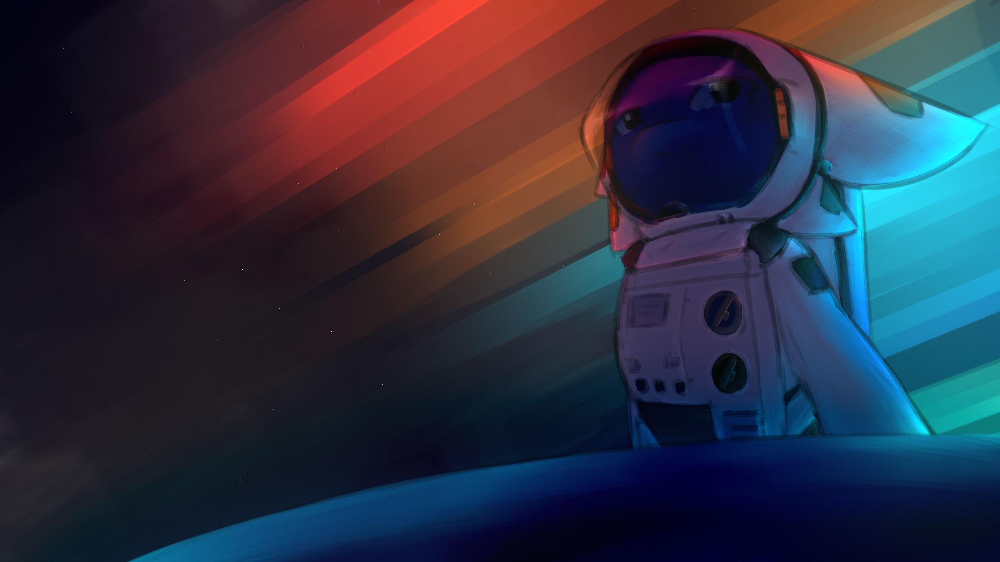

# ©2025-2026 Outer Horizons.

Репозиторий русскоязычного билда по SS14, за базе официального репозитория [space-wizards](https://github.com/space-wizards/space-station-14).

## Ссылки

[Outer Horizons discord](https://discord.gg/uvfshUXu9a)

## Контрибьют

Имейте в виду, что при контрибьюции вы автоматически соглашаетесь с условиями ICLA, [указанными в следующем файле](https://github.com/MrUonov/the-outer-horizons/blob/master/LICENSE_ICLA.txt). Ознакомтесь с условиями, чтобы избежать недопонимания при дальнейшем контрибьюте.

## Сборка

1. Склонируйте этот репозиторий локально
2. Запустите `RUN_THIS.py` для инициализации подмодулей и скачивания движка.
3. Скомпилируйте проект.

Внутри проекта уже есть заготовленные .sh файлы для быстрого запуска, после того как вы настроите все необходимое для работы с репозиторием.

[Более подробная инструкция по запуску проекта.](https://docs.spacestation14.com/en/general-development/setup.html)

## Лицензия

- Ниже указано только краткое описание лицензий. С подробностями лицензий вы можете ознакомиться перейдя по ниже оставленным ссылкам, или в файлах проекта.

- Если не указано иное, весь исходный код и ассеты, находящиеся в папках _OuterHorizons, подпадают под условия, указанные в файле [LICENSE_OH14.TXT](https://github.com/MrUonov/the-outer-horizons/blob/master/LICENSE_OH14.TXT) (All rights reserved). Все ресурсы/контент в этих папках подпадают под CC-BY-SA 4.0, если не указано иное.

- Любой контент из SpaceWizards/SpaceStation14 без указанной лицензии на любой код лицензируется в соответствии с MIT ([LICENSE.txt](https://github.com/MrUonov/the-outer-horizons/blob/master/LICENSE.TXT)). Любой контент Space Wizards лицензируется в соответствии с CC-BY-SA 3.0 для Space Wizards Federation & Contributors.

- Вы не имеете права использовать код и ассеты Outer Horizons в других проектах, без специального разрешения автора Outer Horizons (aserovich).

- Вы не можете создавать форки Outer Horizons для открытия собственных публичных серверов.
